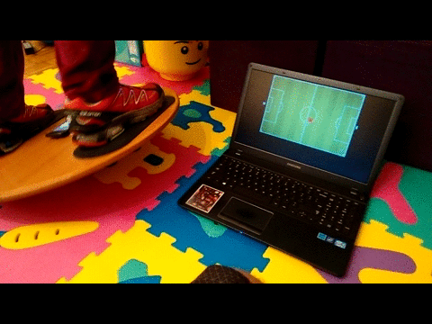

#Balance Board



Install this android app [https://play.google.com/store/apps/details?id=org.zwiener.wimu]( https://play.google.com/store/apps/details?id=org.zwiener.wimu)

Start the app to begin sending sensor data through UDP.

The server reads the sensor data from udp and sends it forward to all connected websocket clients. You start the server like this:

```
go run servers/accel/accel.go
```

From the client you can read the sensor data form websocket:

```javascript
var conn = new WebSocket("ws://localhost:8000/ws");
conn.onmessage = function(evt) {
    console.log(evt.data);
}
```

the data is in this format:

```javascript
{"Type":"accelerometer","From":"192.168.100.82","X":-0.531,"Y":-0.341,"Z":9.834}
```

Some example games which use the accelerometer data as input are [here](apps/)
